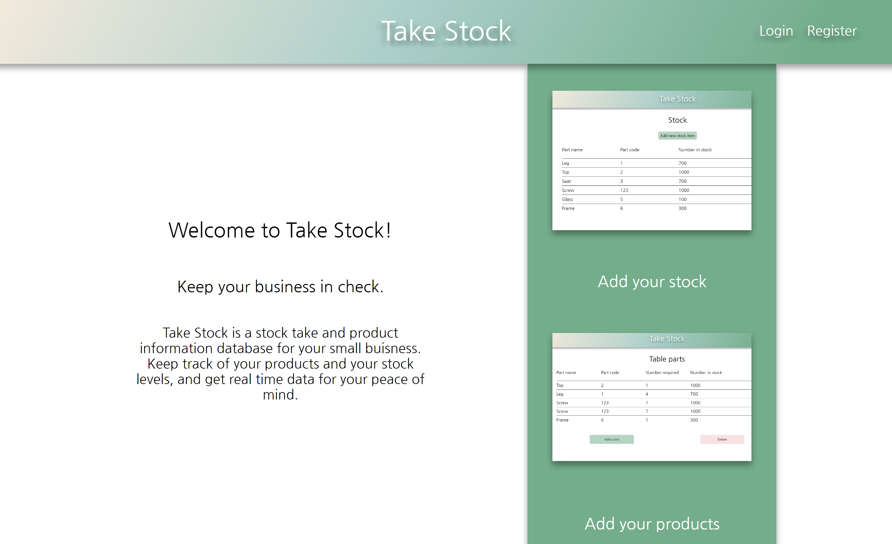
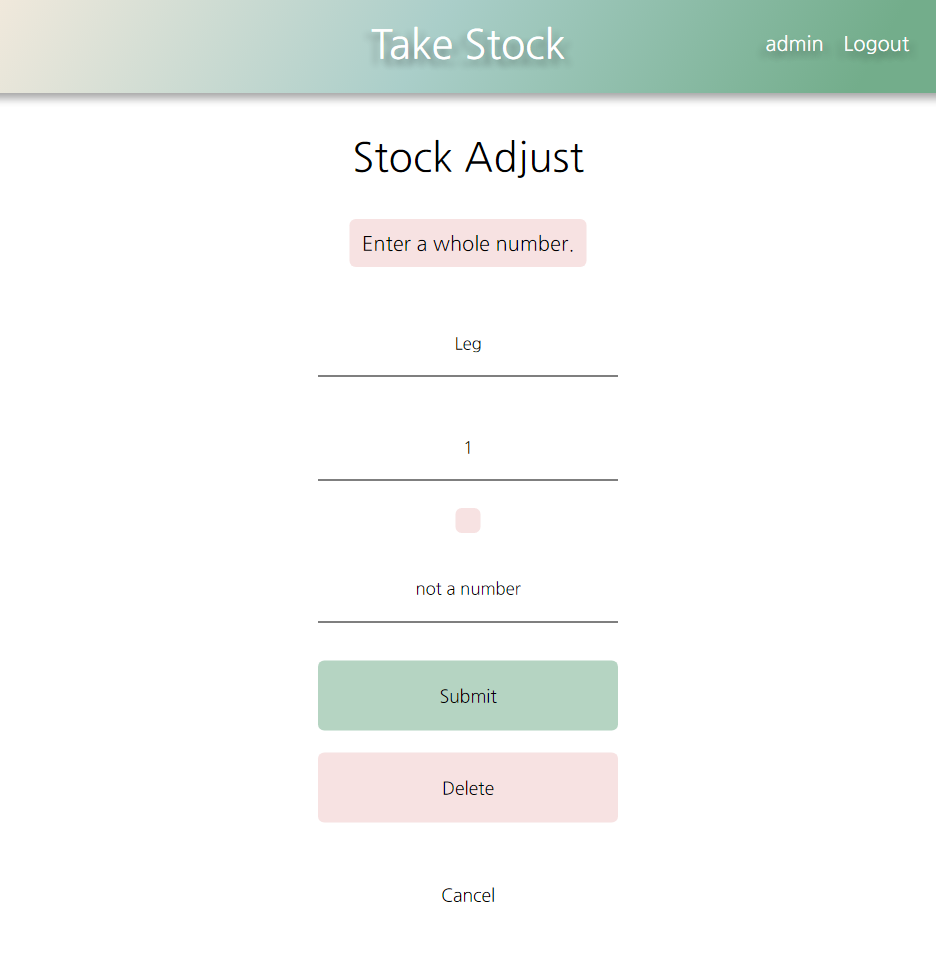

# Testing

## Automated Testing

- Automated tests were ran in Django's Unittest. Tests were conducted on URLs, views, and forms in their own respective files.

- The coverage report from Unittest shows a coverage of 71%. Code that was not covered in Unittest was tested manually (see [below](#manual-testing))

### URLs  
- Automated tests ensured that each page resolved to the correct location. URLs that required arguments to resolve where tested manually using multiple users to ensure they could only access pages with their data on it.

### Views
- Automated tests tested for GET requests only. POST request were tested manually.

### Forms
- Automated tests were performed for valid and invalid forms. Login and register forms were tested manually:
  - Logging in and register forms show errors if applicable.

## Manual Testing

- Manual testing of the site was undertaken at every step of development. 

- All URLs were followed to ensure they resolved correctly. An error message page is displayed to a user who tries to navigate to a page they shuoldn't have access to and allows them to navigate back to the home page.

- All CRUD functionality on the user end was tested manually. Products, Stock items, and Product/Part links all work as expected and users only have access to their own data when guided through forms.

- Forms have validation and will not post data if any errors are raised.

- The site was tested on Google Chrome using their developer tools and viewed on Firefox, Microsoft Edge, and Safari to ensure it worked across multiple platforms. The site was also viewed on multiple devices of varying screen sizes.

## User Story Testing

### First time visitor goals:
- Have the first visit easily explain the site, how it works, what it can do, etc.

  

  - The logged out home page has a quick explanation of what the product is used for. The three images and their captions give insight into how to use the site:
    - Add your stock
    - Add your products
    - Get real time data

- Have the app be easy to navigate and intuitive to use.

  

  - The logged in home screen has very limited navigation. Two main pages, login/logout, user profile navigation, and a link to the home page in the logo. 

- Be able to sign up for an account as easily as possible.

  

  - From the logged out home page to the register page is one click. The register form has full validation and error messages should the form try to be submitted incorrectly.

  

### Returning visitor goals:
- Be able to login and view and edit data stored from previous visits.

  

  

  

  - Users can login, view, and update their data at any time. 

  - Forms throw errors if the wrong data type is submitted:

### Frequent user goals:
- Be able to quickly see what I have in stock and how many products I can make.

  

- Be able to add new products and/or stock quickly and easily and see that immediately reflected in the interface.

  

  - Clicking the link will take a user to that products detailed item list:

  

### Admin user goals:
- Have access to other user data to be able to check for and remove objectionable inputs.

  

  - The admin user has access to all pages for all users. Following the links take the admin to the same page a regular user would have access to where steps can be taken to remove or update stock or products.

### Site owner goals: 
- Have the interface be easy to navigate and reflect recent actions to the user. 

  

  - Following delete links takes the user to a page that looks similar to this, where the user is warned that deleting either stock or a product is irreversible. Deleting in this instance redirects the user to the products page where the deleted product can no longer be found.

- Show the user exactly how many of each product they can make.

  

  - As seen above, in frequent user goals, Product1 required 5 legs while 700 are in stock. As suck on the product page, the app calculates that 140 units of Product 1 can be made.

  

  

  - Changing the amount of legs in stock to 400 instantly changes the amount of Product1 that can be made, bringing the new amount down to 80.

  - For an product with many parts such as a table:

  

  

  - The app takes all the required items, compares how many of each are in stock against how many are required for the product, and uses the smallest total to tell the user how many of that product can be made. In this case, the smallest total is 100. 4 legs are required and there are only 400 in stock, so the maximum amount of tables that can be made is 100. 

  - (Top = 1000, Leg = 100, Screw = 142, Frame = 300)

- Have user data be only accessable to that specific user.

  `default_user = request.user`

  `stock = Stock.objects.filter(company=default_user)`

  - Most if not all views query the database by filtering models by the current user. This means that before the view is even rendered, the only data being sent to the template is the data that user is allowed to see.

## Validators

- The original project was constructed on a laptop with a screen size of 12.3 inches. The code was put through validators and passed through without any issues.

  - [W3C Markup Validator](https://validator.w3.org/)

  - [W3C CSS Validator](https://jigsaw.w3.org/css-validator/)

  - [Javascript Validator - JShint](https://jshint.com/)

    - The JavaScript code was passed with /* jshint esversion: 6 */ above it which removed warnings for setting variables with 'let'.
  
  - [PEP8 Python Validator](http://pep8online.com/)

### Known bugs

### Google Lighthouse
- Google Chrome's DevTools Lighthouse:
  - Desktop
    
  - Mobile
    
        